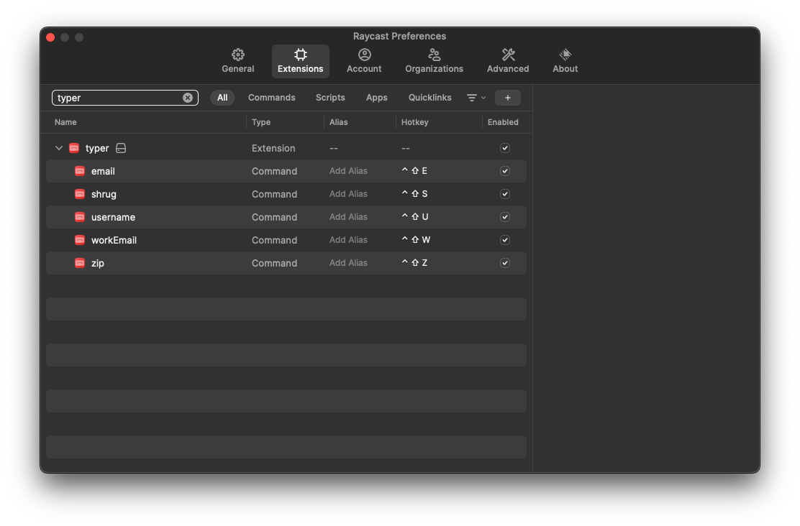

# Typer - A Raycast Extension for the Lazy Typers
This is an [extension](https://github.com/raycast/extensions) for [Raycast](https://www.raycast.com/), which enables Hotkeys to save you from typing things like your email address or any other string you type on a daily basis.

>Note: This extension probably won't be published on the Raycast store, since it auto-generates commands, and doesn't have a static manifest.

## Prerequisites
1. [Raycast](https://www.raycast.com/) installed on your system (Mac only).
2. NodeJS (version >= 16) + npm
3. [jq](https://stedolan.github.io/jq/)

## Usage
1. Clone the repository into your local machine.
2. Run `npm install` to install dependencies.
3. Create a file named `strings.json` in the top-level directory of the repo.
4. The structure of `strings.json` is a list of key-value pairs.
```json
[
  {"key": "email", "value": "myemailaddress@myemailserver.com"},
  {"key": "address", "value": "some street name and number, some city"},
  ...
]
```
5. Run the `autogen.sh` script from your terminal.
6. For each key, a new `<key>.ts` file will be created in the `src` directory, which will be the entry point for a corresponding Raycast `command` that will be added to `package.json` (which also acts as the manifest file for the extension).
7. Run `npm dev` to compile and install the extension. Raycast will automatically open once the process is complete.
8. press ^C to stop the `dev` process. The extension will remain installed.
9. In Raycast's app properties, you can set a specific Hotkey for every command you just created. Now you can use this Hotkey to save some typings!

